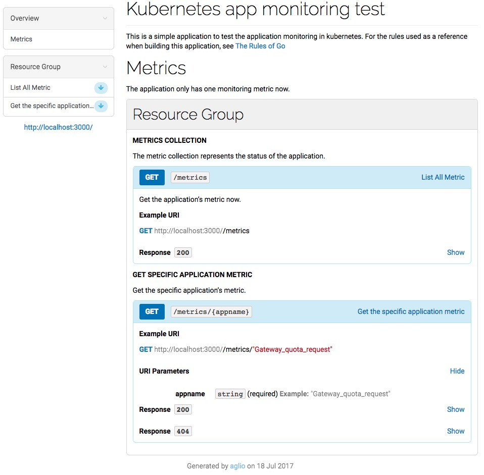
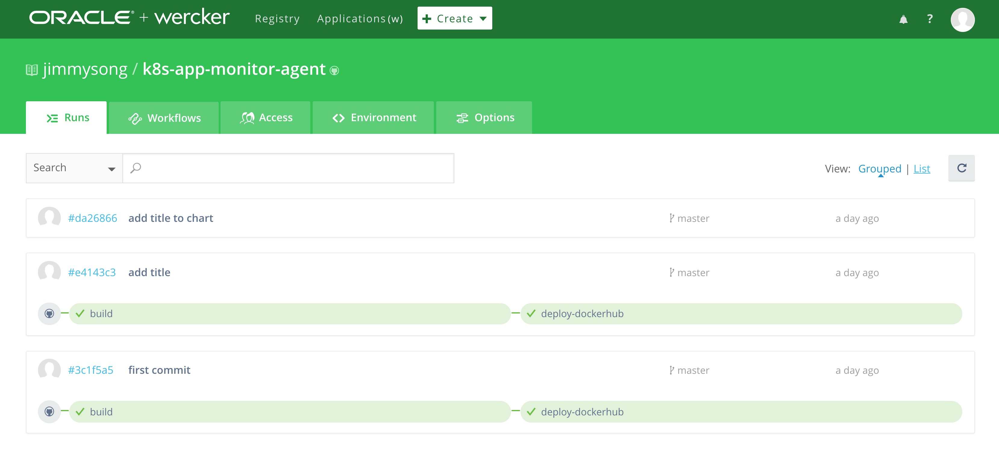
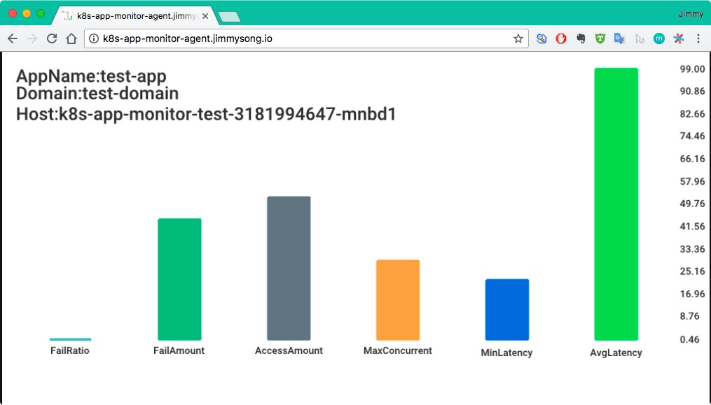

# 适用于kubernetes的应用开发部署流程

为了讲解详细流程，我特意写了两个示例程序放在GitHub中，模拟监控流程：

- [k8s-app-monitor-test](https://github.com/rootsongjc/k8s-app-monitor-test)：生成模拟的监控数据，发送http请求，获取json返回值
- [K8s-app-monitor-agent](https://github.com/rootsongjc/k8s-app-monitor-agent)：获取监控数据并绘图，访问浏览器获取图表

API文档见[k8s-app-monitor-test](https://github.com/rootsongjc/k8s-app-monitor-test)中的`api.html`文件，该文档在API blueprint中定义，使用[aglio](https://github.com/danielgtaylor/aglio)生成，打开后如图所示：



**关于服务发现**

`K8s-app-monitor-agent`服务需要访问`k8s-app-monitor-test`服务，这就涉及到服务发现的问题，我们在代码中直接写死了要访问的服务的内网DNS地址（kubedns中的地址，即`k8s-app-monitor-test.default.svc.cluster.local`）。

我们知道Kubernetes在启动Pod的时候为容器注入环境变量，这些环境变量在所有的 namespace 中共享（环境变量是不断追加的，新启动的Pod中将拥有老的Pod中所有的环境变量，而老的Pod中的环境变量不变）。但是既然使用这些环境变量就已经可以访问到对应的service，那么获取应用的地址信息，究竟是使用变量呢？还是直接使用DNS解析来发现？

答案是使用DNS，详细说明见[Kubernetes中的服务发现与Docker容器间的环境变量传递源码探究](http://rootsongjc.github.io/blogs/exploring-kubernetes-env-with-docker/)。

**打包镜像**

因为我使用wercker自动构建，构建完成后自动打包成docker镜像并上传到docker hub中（需要现在docker hub中创建repo）。

构建流程见：https://app.wercker.com/jimmysong/k8s-app-monitor-agent/



生成了如下两个docker镜像：

- jimmysong/k8s-app-monitor-test:latest
- jimmysong/k8s-app-monitor-agent:latest

**启动服务**

所有的kubernetes应用启动所用的yaml配置文件都保存在那两个GitHub仓库的`manifest.yaml`文件中。

分别在两个GitHub目录下执行`kubectl create -f manifest.yaml`即可启动服务。

**外部访问**

服务启动后需要更新ingress配置，在[ingress.yaml](../manifests/traefik-ingress/ingress.yaml)文件中增加以下几行：

```Yaml
  - host: k8s-app-monitor-agent.jimmysong.io
    http:
      paths:
      - path: /
        backend:
          serviceName: k8s-app-monitor-agent
          servicePort: 8080
```

保存后，然后执行`kubectl replace -f ingress.yaml`即可刷新ingress。

修改本机的`/etc/hosts`文件，在其中加入以下一行：

```
172.20.0.119 k8s-app-monitor-agent.jimmysong.io
```

当然你也可以加入到DNS中，为了简单起见我使用hosts。

详见[边缘节点配置](practice/edge-node-configuration.md)。

在浏览器中访问http://k8s-app-monitor-agent.jimmysong.io

