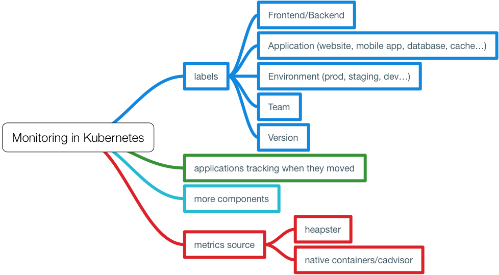
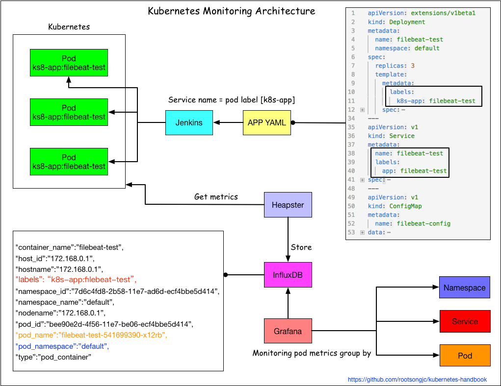
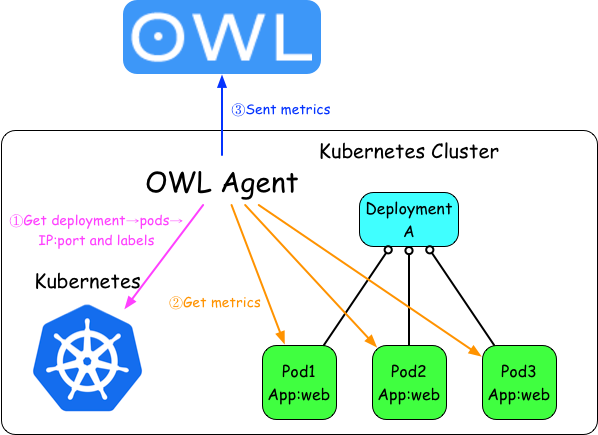
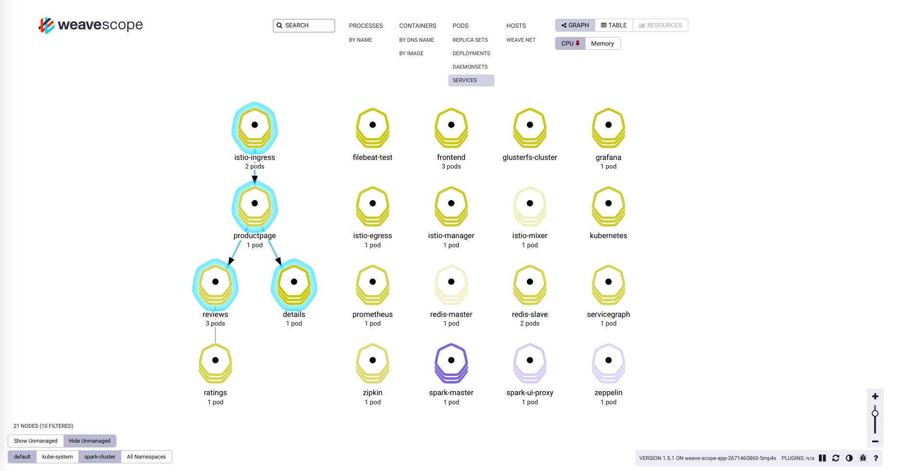

# 集群及应用监控

在前面的[安装heapster插件](heapster-addon-installation.md)章节，我们已经谈到Kubernetes本身提供了监控插件作为集群和容器监控的选择，但是在实际使用中，因为种种原因，再考虑到跟我们自身的监控系统集成，我们准备重新造轮子。

针对kubernetes集群和应用的监控，相较于传统的虚拟机和物理机的监控有很多不同，因此对于传统监控需要有很多改造的地方，需要关注以下三个方面：

- Kubernetes集群本身的监控，主要是kubernetes的各个组件
- kubernetes集群中Pod的监控，Pod的CPU、内存、网络、磁盘等监控
- 集群内部应用的监控，针对应用本身的监控

## Kubernetes集群中的监控



跟物理机器和虚拟机的监控不同，在kuberntes集群中的监控复杂度更高一些，因为多了一个虚拟化层，当然这个跟直接监控docker容器又不一样，kubernetes在docker之上又抽象了一层service的概念。

在kubernetes中的监控需要考虑到这几个方面：

- 应该给Pod打上哪些label，这些label将成为监控的metrics。
- 当应用的Pod漂移了之后怎么办？因为要考虑到Pod的生命周期比虚拟机和物理机短的多，如何持续监控应用的状态？
- 更多的监控项，kubernetes本身、容器、应用等。
- 监控指标的来源，是通过heapster收集后汇聚还是直接从每台主机的docker上取？

## 容器的命名规则

首先我们需要清楚使用cAdvisor收集的数据的格式和字段信息。

当我们通过cAdvisor获取到了容器的信息后，例如访问`${NODE_IP}:4194/api/v1.3/docker`获取的json结果中的某个容器包含如下字段：

```json
        "labels": {
            "annotation.io.kubernetes.container.hash": "f47f0602", 
            "annotation.io.kubernetes.container.ports": "[{\"containerPort\":80,\"protocol\":\"TCP\"}]", 
            "annotation.io.kubernetes.container.restartCount": "0", 
            "annotation.io.kubernetes.container.terminationMessagePath": "/dev/termination-log", 
            "annotation.io.kubernetes.container.terminationMessagePolicy": "File", 
            "annotation.io.kubernetes.pod.terminationGracePeriod": "30", 
            "io.kubernetes.container.logpath": "/var/log/pods/d8a2e995-3617-11e7-a4b0-ecf4bbe5d414/php-redis_0.log", 
            "io.kubernetes.container.name": "php-redis", 
            "io.kubernetes.docker.type": "container", 
            "io.kubernetes.pod.name": "frontend-2337258262-771lz", 
            "io.kubernetes.pod.namespace": "default", 
            "io.kubernetes.pod.uid": "d8a2e995-3617-11e7-a4b0-ecf4bbe5d414", 
            "io.kubernetes.sandbox.id": "843a0f018c0cef2a5451434713ea3f409f0debc2101d2264227e814ca0745677"
        },
```

这些信息其实都是kubernetes创建容器时给docker container打的`Labels`，使用`docker inspect $conainer_name`命令同样可以看到上述信息。

你是否想过这些label跟容器的名字有什么关系？当你在node节点上执行`docker ps`看到的容器名字又对应哪个应用的Pod呢？

在kubernetes代码中pkg/kubelet/dockertools/docker.go中的BuildDockerName方法定义了容器的名称规范。

这段容器名称定义代码如下：

```go
// Creates a name which can be reversed to identify both full pod name and container name.
// This function returns stable name, unique name and a unique id.
// Although rand.Uint32() is not really unique, but it's enough for us because error will
// only occur when instances of the same container in the same pod have the same UID. The
// chance is really slim.
func BuildDockerName(dockerName KubeletContainerName, container *v1.Container) (string, string, string) {
	containerName := dockerName.ContainerName + "." + strconv.FormatUint(kubecontainer.HashContainerLegacy(container), 16)
	stableName := fmt.Sprintf("%s_%s_%s_%s",
		containerNamePrefix,
		containerName,
		dockerName.PodFullName,
		dockerName.PodUID)
	UID := fmt.Sprintf("%08x", rand.Uint32())
	return stableName, fmt.Sprintf("%s_%s", stableName, UID), UID
}

// Unpacks a container name, returning the pod full name and container name we would have used to
// construct the docker name. If we are unable to parse the name, an error is returned.
func ParseDockerName(name string) (dockerName *KubeletContainerName, hash uint64, err error) {
	// For some reason docker appears to be appending '/' to names.
	// If it's there, strip it.
	name = strings.TrimPrefix(name, "/")
	parts := strings.Split(name, "_")
	if len(parts) == 0 || parts[0] != containerNamePrefix {
		err = fmt.Errorf("failed to parse Docker container name %q into parts", name)
		return nil, 0, err
	}
	if len(parts) < 6 {
		// We have at least 5 fields.  We may have more in the future.
		// Anything with less fields than this is not something we can
		// manage.
		glog.Warningf("found a container with the %q prefix, but too few fields (%d): %q", containerNamePrefix, len(parts), name)
		err = fmt.Errorf("Docker container name %q has less parts than expected %v", name, parts)
		return nil, 0, err
	}

	nameParts := strings.Split(parts[1], ".")
	containerName := nameParts[0]
	if len(nameParts) > 1 {
		hash, err = strconv.ParseUint(nameParts[1], 16, 32)
		if err != nil {
			glog.Warningf("invalid container hash %q in container %q", nameParts[1], name)
		}
	}

	podFullName := parts[2] + "_" + parts[3]
	podUID := types.UID(parts[4])

	return &KubeletContainerName{podFullName, podUID, containerName}, hash, nil
}
```

我们可以看到容器名称中包含如下几个字段，中间用下划线隔开，至少有6个字段，未来可能添加更多字段。

下面的是四个基本字段。

```
containerNamePrefix_containerName_PodFullName_PodUID
```

所有kubernetes启动的容器的containerNamePrefix都是k8s。

Kubernetes启动的docker容器的容器名称规范，下面以官方示例guestbook为例，Deployment 名为 frontend中启动的名为php-redis的docker容器的副本书为3。

Deployment frontend的配置如下：

```yaml
apiVersion: extensions/v1beta1
kind: Deployment
metadata:
  name: frontend
spec:
  template:
    metadata:
      labels:
        app: guestbook
        tier: frontend
    spec:
      containers:
      - name: php-redis
        image: bj-xg-oam-docker-hub-001.tendcloud.com/library/gb-frontend:v4
        resources:
          requests:
            cpu: 100m
            memory: 100Mi
        env:
        - name: GET_HOSTS_FROM
          value: dns
        ports:
        - containerPort: 80
```

我们选取三个实例中的一个运行php-redis的docker容器。

```
k8s_php-redis_frontend-2337258262-154p7_default_d8a2e2dd-3617-11e7-a4b0-ecf4bbe5d414_0
```

- containerNamePrefix：k8s
- containerName：php-redis
- podFullName：frontend-2337258262-154p7
- computeHash：154p7
- deploymentName：frontend
- replicaSetName：frontend-2337258262
- namespace：default
- podUID：d8a2e2dd-3617-11e7-a4b0-ecf4bbe5d414

kubernetes容器命名规则解析，见下图所示。


## 使用Heapster进行集群监控

[Heapster](https://github.com/kubernetes/heapster)是kubernetes官方提供的监控方案，我们在前面的章节中已经讲解了如何部署和使用heapster，见[安装Heapster插件](../practice/heapster-addon-installation.md)。

但是Grafana显示的指标只根据Namespace和Pod两层来分类，实在有些单薄，我们希望通过应用的label增加service这一层分类。架构图如下：



在不改变原有架构的基础上，通过应用的label来区分不同应用的pod。

## 应用监控

Kubernetes中应用的监控架构如图：



这种方式有以下几个要点：

- 访问kubernetes API获取应用Pod的IP和端口
- Pod labels作为监控metric的tag
- 直接访问应用的Pod的IP和端口获取应用监控数据
- metrics发送到[OWL](https://github.com/talkingdata/owl)中存储和展示

## 应用拓扑状态图

对于复杂的应用编排和依赖关系，我们希望能够有清晰的图标一览应用状态和拓扑关系，因此我们用到了Weaveworks开源的[scope](https://github.com/weaveworks/scope)。

**安装scope**

我们在kubernetes集群上使用standalone方式安装，详情参考[Installing Weave Scope](https://www.weave.works/docs/scope/latest/installing/#k8s)。

使用[scope.yaml](../manifests/weave/scope.yaml)文件安装scope，该服务安装在`kube-system` namespace下。

```Bash
$ kubectl apply -f scope.yaml
```

创建一个新的Ingress：`kube-system.yaml`，配置如下：

```yaml
apiVersion: extensions/v1beta1
kind: Ingress
metadata:
  name: traefik-ingress
  namespace: kube-system
spec:
  rules:
    - host: scope.weave.io
      http:
        paths:
        - path: /
          backend:
            serviceName: weave-scope-app
            servicePort: 80
```

执行`kubectl apply -f kube-system.yaml`后在你的主机上的`/etc/hosts`文件中添加一条记录：

```
172.20.0.119 scope.weave.io
```

在浏览器中访问`scope.weave.io`就可以访问到scope了，详见[边缘节点配置](edge-node-configuration.md)。



如上图所示，scope可以监控kubernetes集群中的一系列资源的状态、资源使用情况、应用拓扑、scale、还可以直接通过浏览器进入容器内部调试等。

## 参考

[Monitoring in the Kubernetes Era](https://www.datadoghq.com/blog/monitoring-kubernetes-era/)